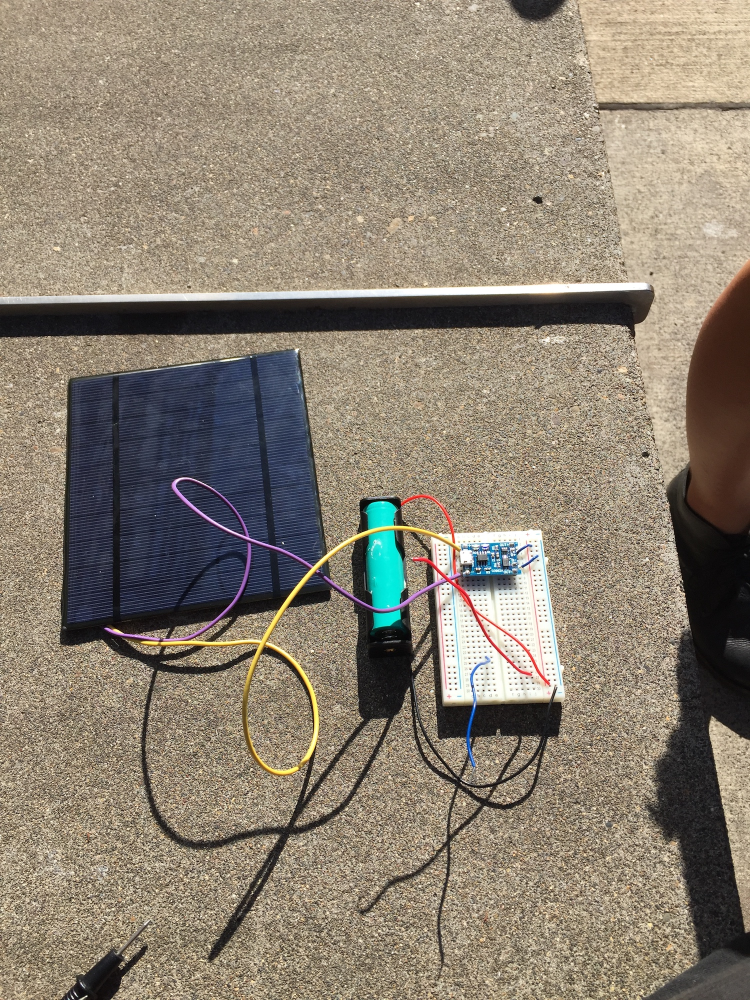
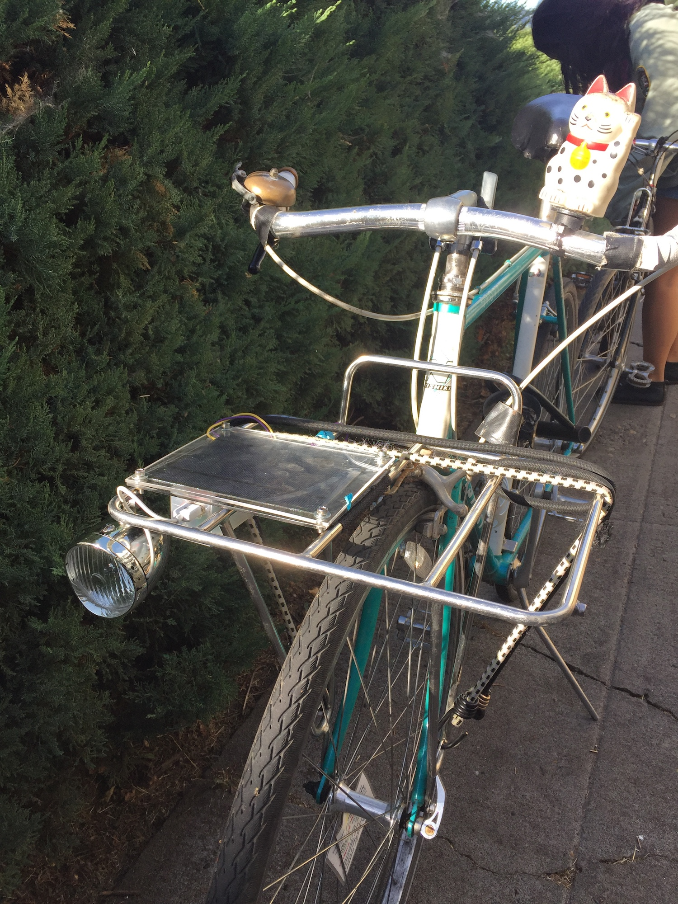

# solar-bike-project-repository

- What did you do?

Prototyped a solar powered bike light and installed it on my bike.

- What equipment, tools, software, and/or hardware did you use?

  - 18650 3.7v Lithium Ion Battery Cell (Harvested from an old HP Laptop Battery)
  - [XCSource TP4056 breakout board](https://www.amazon.com/XCSOURCE-Lithium-Battery-Charger-TE585/dp/B01LZSC7I8/ref=sr_1_4?ie=UTF8&qid=1505237169&sr=8-4&keywords=tp4056) (Lithium battery charger/overcharge/discharge controller)
  - [18650 Clip Holder Box Case with Wire Lead](https://www.amazon.com/Kangnice-18650-Rechargeable-Battery-Holder/dp/B071VM9648/ref=sr_1_1?s=automotive&ie=UTF8&qid=1505237219&sr=1-1&keywords=18650+holder)
  - Acrylic (Cut with laser cutter)
  - Hex driven nuts/bolts/washer hardware for acrylic (holes drilled with drill bit)
  - Hot glue (Need something stronger though)
  - [Coromose Retro Bicycle Bike](https://www.amazon.com/gp/product/B00T9M2JGI/ref=oh_aui_detailpage_o01_s00?ie=UTF8&psc=1)
  - Old USB Cable

- Who is this project for?

Any electronics beginners who want to make their own bike light

- Can others contribute to your project?

Yes please let me know how I can improve the design and components!

